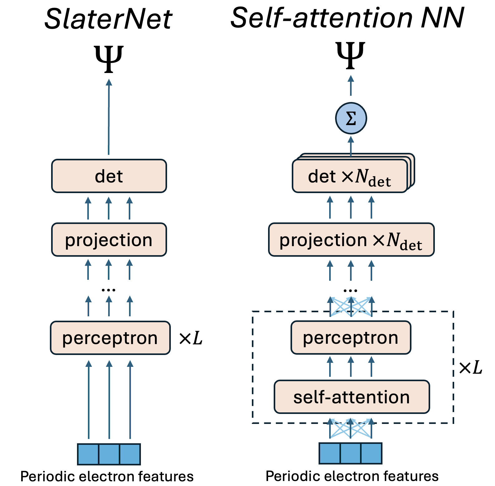
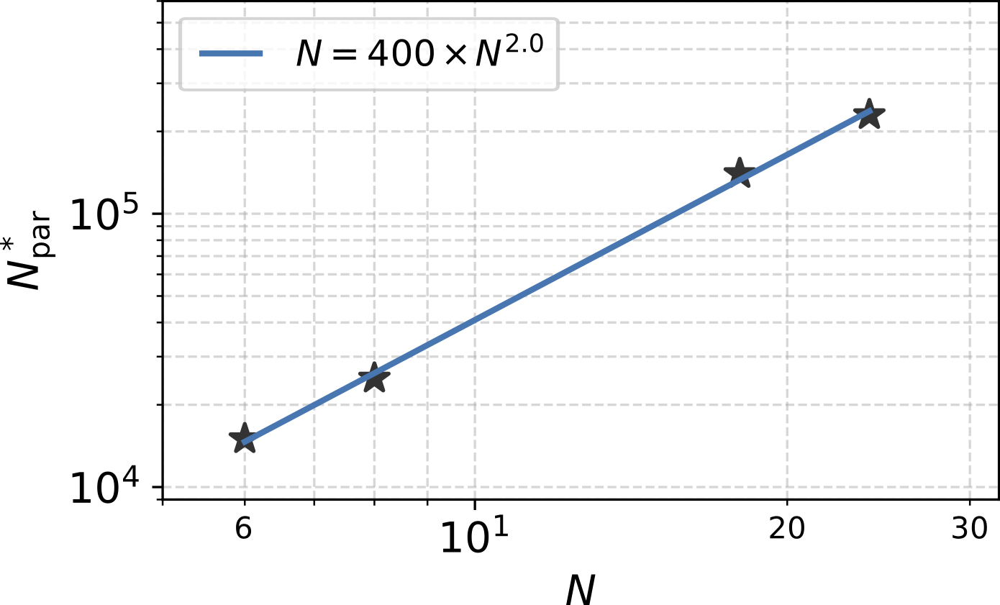

# 注意力机制能否解决强关联电子问题？

## 一、薛定谔的千年难题

求解多电子薛定谔方程，是凝聚态物理领域一个逾九十年的"梦魇"。问题的症结在哪里？希尔伯特空间的维度随粒子数呈指数爆炸。

咱们打个比方：如果两个电子可以形成四种状态，那三个电子就有八种，四个电子十六种……到了宏观尺度的固体，这数字能绕宇宙好几圈。

传统的哈特里-福克（Hartree-Fock）方法，把问题简化成"每个电子独立运动"，虽然通常能捕获总能量的约99%，但恰恰缺了那关键的一1%——关联效应。而这1%，正是高温超导、分数量子霍尔效应等奇异量子现象的幕后推手。

近年来，神经网络变分蒙特卡洛（Neural Network Variational Monte Carlo，NN-VMC）横空出世，让物理学家看到了曙光。MIT傅亮教授团队最新发表在arXiv上的工作，更是将这场"AI+物理"的革命推向新高度。

## 二、Transformer：从NLP到量子力学

Transformer的注意力机制（attention mechanism），原本是为解决自然语言处理中的"上下文理解"而生。它的核心思想很简单：让模型学会"关注"文本中哪些部分更重要。

但在傅亮团队手中，这个机制摇身一变，成为刻画电子之间相互作用的利器。

想想看，电子们在固体里跳舞，每动一步都要考虑其他所有电子的位置和动量。这不就是一种"注意力"吗？谁离我最近？谁对我的影响最大？我们之间的纠缠有多深？

论文提出的**自注意力神经网络波函数（Self-Attention Neural Network Wavefunction）**，正是抓住了这个物理本质。它不预设任何先验知识，完全让神经网络自己去"发现"电子之间的关联规律。

## 三、从SlaterNet到Attention：两步登顶

论文的技术路线颇有"禅意"：分两步走。

第一步，构造**SlaterNet**。这是一个深度前馈神经网络，用来生成单粒子轨道。相当于用神经网络来"扮演" unrestricted Hartree-Fock 的角色。它的数学形式很漂亮：

每个电子的坐标经过一个"特征化"处理——对于周期系统，用正弦和余弦函数将坐标映射到周期特征空间，确保相邻位置在特征空间里也相邻。然后通过多层感知器，最终投影成复数形式的单粒子轨道。

从技术细节上看，这个网络有三层，每层包含6个注意力头。电子的坐标首先通过正弦和余弦函数编码成周期特征，确保相邻位置在特征空间里也相邻——这对处理周期系统至关重要。然后经过多层感知器的非线性变换，最终投影成复数形式的单粒子轨道。每层感知器之间插入的自注意力模块，让每个电子都能"看到"其他所有电子的状态，并计算它们之间的相似度（用点积衡量），再用指数函数加权，得到最终的"注意力加权"信息流。

这个SlaterNet本身就能超越传统的Hartree-Fock，因为它不依赖任何解析形式，完全是"黑箱"学习。

第二步，引入**自注意力机制**。这才是重头戏。

在每一层感知器之间，插入一个自注意力模块。它的作用是：让每个电子"看到"所有其他电子的状态，然后根据"相似度"（similarity）来决定如何修正自己的轨道。

具体来说，对每个电子的状态向量，通过三个可学习的线性变换，生成"键"（key）、"查询"（query）和"值"（value）这三个特征。然后计算所有电子对之间的相似度，用指数函数加权，得到每个电子应该"借鉴"哪些电子的信息。

这个过程，数学上等价于在电子的"关系图"上做信息传播。而整个网络，就是在学习这张关系图的结构。

最终波函数的形式，是多个广义Slater行列式的叠加。每个行列式里的"轨道"，不再是固定的函数，而是依赖于所有其他电子位置的"相关轨道"（correlated orbital）。

这种形式，理论上是普适的——任何费米子波函数都可以写成这样的广义Slater行列式形式（只要允许函数不连续）。

## 四、莫尔系统：完美的试金石

理论再美，也要经得起检验。傅亮团队选择了一个极具挑战性的舞台：半导体莫尔异质结，比如WSe₂/WS₂。

这是一个二维电子气体，在一个周期性莫尔势场中运动。哈密顿量包含三个部分：动能、莫尔势能、电子间库仑相互作用。虽然形式简单，但这系统能展现出丰富多彩的电子相：莫特绝缘体、广义维格纳晶体、强关联费米液体等等。

为什么选这个系统？因为它正好处于"可计算"与"可观测"的黄金分割点——既有足够的物理丰富性，又能在数值上精确求解。

团队做了什么？

首先，对于小系统，他们将神经网络的结果与带投影精确对角化（Band-Projected Exact Diagonalization，BP-ED）进行了benchmark。令人惊讶的是，即使BP-ED包含五个能带，神经网络仍然得到了更低的能量——对于18电子系统，能量降低约0.75 meV（弱相互作用）到1.32 meV（强相互作用）。

这意味什么？神经网络不仅能捕捉传统方法能描述的关联，还能发现传统方法忽略的微妙关联效应。

其次，他们研究了网络性能随系统规模的扩展规律。这是一个关键问题：当电子数增加时，需要多少参数才能保持精度？

结果令人振奋：**在研究的莫尔系统（ν=2/3填充）中，发现所需参数数N_par与电子数N的缩放关系近似为N^2**，即指数α≈2。这一规律虽然目前仅在特定系统和网络架构下验证，但为估计参数规模提供了重要参考。相比之下，二维张量网络方法在面积律假设下需要∝e^√N个参数。

这个N^2缩放，暗示自注意力神经网络在描述大规模强关联系统方面，可能比传统张量网络方法更高效。

当然，变分蒙特卡洛方法有其固有误差。通过增加批大小和采样步数，可以将统计误差控制在所需精度内。论文报告的数值都包含了统计误差（标准差），确保了结果的可靠性。

## 五、从费米液体到维格纳晶体

但最让人激动的，是网络不仅能算能量，还能"看懂"物理相。

通过调节介电常数ε，可以控制电子相互作用的强度（ε越小，相互作用越强）。当相互作用很弱时，电子是离域的，系统处于自由电子或费米液体状态；当相互作用很强时，库仑排斥让电子"尽量离得远一些"，系统就会过渡到电子晶体状态。

在ν=2/3填充下，费米液体的电荷密度呈现三角晶格图案，而广义维格纳晶体的电荷密度则是蜂窝晶格。

最反直觉的是什么？当相互作用极强时，电子们反而"结晶"成有序阵列——这和我们通常理解的"强相互作用导致混沌"恰恰相反。量子世界的逻辑，总是出人意料。

神经网络得到的基态电荷密度分布和密度-密度关联函数，在ε=10时清晰地显示了费米液体的特征，在ε=5时则明确呈现了广义维格纳晶体的特征。

这说明什么？网络不仅能逼近基态能量，还能正确捕捉物理相的本质特征。

更妙的是，从神经网络和SlaterNet的能量差，可以估算出关联能。论文发现，在莫尔系统中，关联能约占总能量的2%，远高于普通分子系统的1%。这正是莫尔系统适合研究强关联现象的原因。

## 六、傅亮：拓扑与关联的双向奔赴

这篇论文的通讯作者傅亮教授，是凝聚态理论领域的大神级人物。

傅亮2004年本科毕业于中国科学技术大学，2009年在宾夕法尼亚大学获得物理学博士学位，之后在哈佛大学担任Junior Fellow，2012年加入MIT物理系。

他的研究兴趣集中在拓扑相（topological phases）及其在材料中的实现。从拓扑绝缘体到拓扑超导体，从拓扑晶体绝缘体的理论预言，到无序和相互作用下的拓扑相变，傅亮的工作贯穿了理论预言与实验验证。

傅亮的数学推导总有一种"建筑师的美感"——每一步都严谨得像在搭建哥特式大教堂，但最后呈现的却是令人惊叹的新结构。这种对"美"的执着，或许正是他能在拓扑与关联两个领域自由穿梭的秘钥。

而这一次，他将目光转向了"关联"——与"拓扑"并列为凝聚态物理两大主题的领域。

这不是偶然。拓扑相研究的是波函数的整体结构（全局性质），关联则关注电子之间的相互作用（局域到非局域的复杂关系）。Transformer的注意力机制，恰好提供了连接这两个世界的桥梁：它既能学习全局关系，又能捕捉局部细节。

这种"双向奔赴"，或许预示着一个新的研究范式：用AI的普适表达能力，去寻找那些人类想象力尚未触及的量子相。

## 七、N^2缩放：效率与精度的平衡艺术

让我们再深入聊聊这个N^2缩放律。

为什么是N^2？直觉上，如果有N个电子，每对电子之间都可能有相互作用，那"关系数"就是N(N-1)/2，即O(N^2)。自注意力机制正好能自然地编码这种两两关系——它计算的是所有电子对之间的相似度，自然涉及O(N^2)次操作。相比之下，传统张量网络在二维系统中需要e^√N个参数，从实际计算角度看更困难。

但N^2够不够？从信息论角度看，描述一个N粒子系统的量子态，需要的参数至少是指数级的（因为希尔伯特空间维度是指数级的）。所以N^2不可能描述所有可能的量子态，但可能足以描述"物理上有意义的"那部分态空间。

这是一种"有偏的普适"——虽然理论上能描述所有态，但实际上网络学到的是那些满足物理约束的低能态。这正是深度学习的神奇之处：通过梯度下降，自动在巨大的参数空间里找到"物理相关"的区域。

与张量网络对比：二维系统的张量网络（如PEPS）在面积律下，所需参数缩放为e^√N。虽然理论上更严格，但实际上计算复杂度极高，很难用于大系统。

自注意力神经网络则提供了一种"更宽松但更实用"的方案：牺牲部分理论保证，换取计算上的可行性。从工程角度看，这是一种明智的权衡。

## 八、零先验：让数据自己说话

这篇论文最震撼的地方，不在于技术细节，而在于哲学立场：**零先验**（zero prior）。

网络的初始化完全是随机的（除神经网络的标准初始化外），唯一的物理约束是费米波函数的反对称性（通过Slater行列式的行列式操作保证）。没有预训练（pretraining），没有从Hartree-Fock出发的热启动，甚至连传统的Jastrow因子都没有。

Jastrow因子通常用来处理两个电子接近时的波函数行为（cusp condition）。在分子系统中，它很关键；但在莫尔系统的低密度电子气中，论文发现加上Jastrow反而让训练变慢10-20%，而且精度提升不明显。

这说明什么？说明网络自己学会了处理cusp condition！这种"自举"的能力，正是深度学习的魅力所在。

当然，"零先验"不意味着"零代价"。训练这样一个网络，需要巨大的计算资源。论文使用了MIT的超算平台，训练迭代次数高达1.5×10^5，批大小（batch size）达到4096。

这是用算力换智能的典范。

## 九、未来展望：从基态到激发态

论文的最后，傅亮团队展望了几个可能的方向。

首先是**激发态**的计算。目前方法只能得到基态，但很多物理现象（如光学性质、输运性质）依赖于激发态。可以通过正交约束或变分原理，扩展到激发态计算。

其次是**格林函数和谱函数**。这些是实验上可以直接观测的量（如ARPES），能更直接地与实验对比。

再者是**有限温度效应**。现实中的系统总是在有限温度下，需要扩展网络来表示热密度矩阵。

还有**动力学系统和开放系统**，可以通过含时变分原理来研究。

这些方向，每一个都是一个巨大的课题。但有了自注意力这个"瑞士军刀"，探索的道路或许会平坦许多。

## 十、结语：注意力的终极形态

回到论文标题："Is attention all you need to solve the correlated electron problem?"

答案似乎是：至少对于很多系统，**注意**真的很有帮助。

从自然语言处理中的"词语关联"，到量子力学中的"电子关联"，注意力机制展现出惊人的普适性。这或许不是一个巧合——语言的本质是符号之间的关联，而量子多体系统的本质，则是粒子之间的纠缠与关联。

当我们凝视Transformer的注意力矩阵时，看到的不仅是数学形式，更是自然界的某种底层逻辑：**万事万物，皆在关联之中**。

傅亮团队的这篇论文，用AI的眼睛，帮我们看清了量子世界的一角。而更广阔的领域，还在等待我们去探索。

---

季燕江/奇迹笔记
